This folder includes the presentation of the methods covered in the article "The impact of Manuka-dominated riparian on lake’s water quality – a multi-source remote sensing approach" by Simna Rassak, The University of Waikato and ESR.

This study employs machine-learning techniques to integrate weather data, remote sensing data, and soil moisture sensor data for predicting daily soil moisture. The framework used in this study consists of six key processes, data extraction, data pre-processing, model training, model validation and comparison, selected model testing and generate new data set integrating the prediction. The study also performs soil moisture, NDVI and soil loss comparison of experimental plot with Manuka riparian and control plot without Manuka.

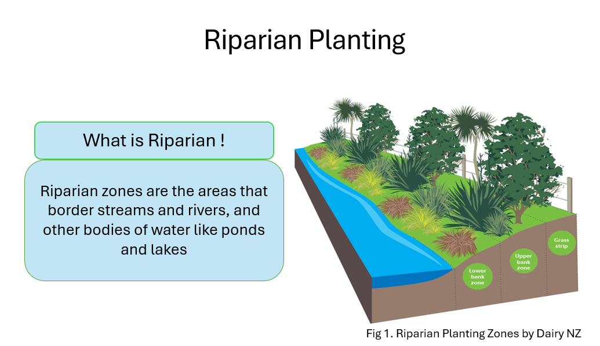
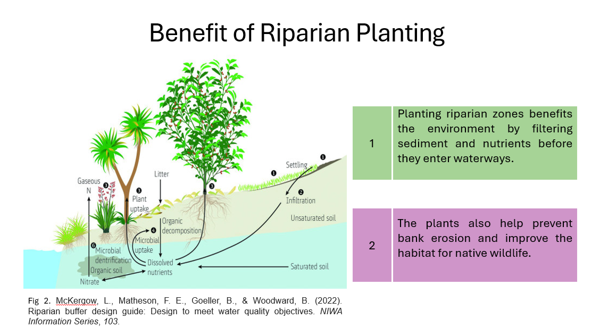
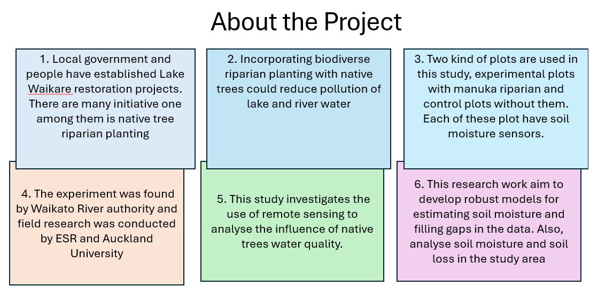
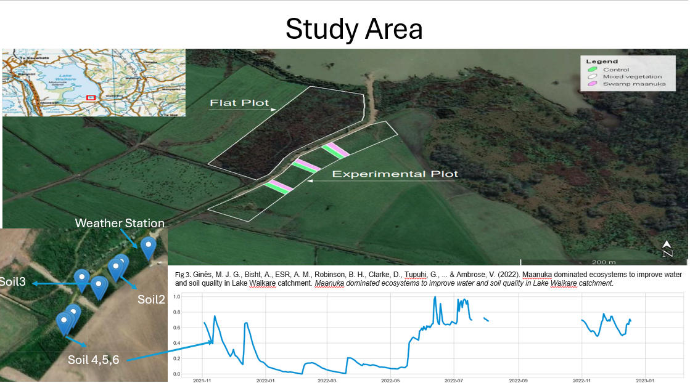
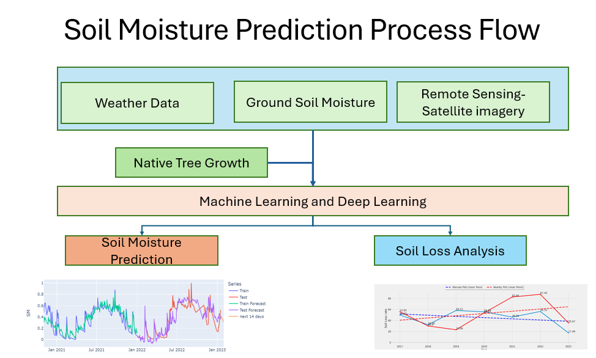
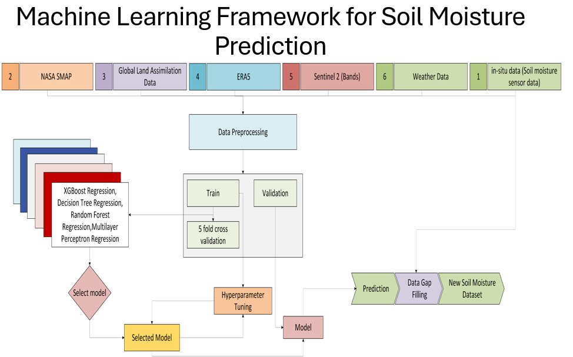
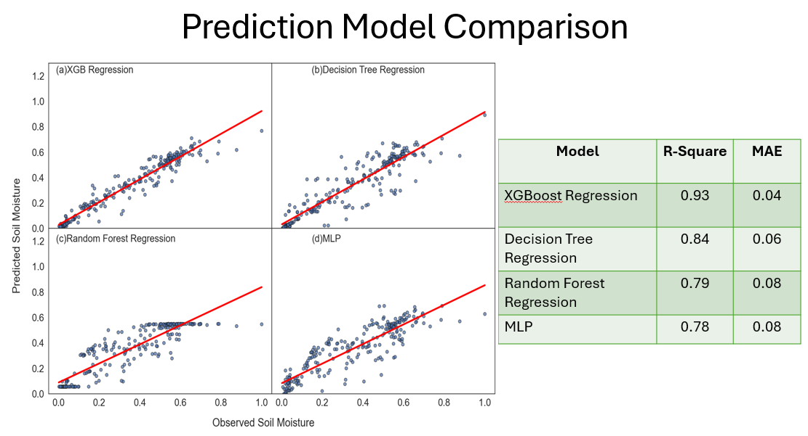
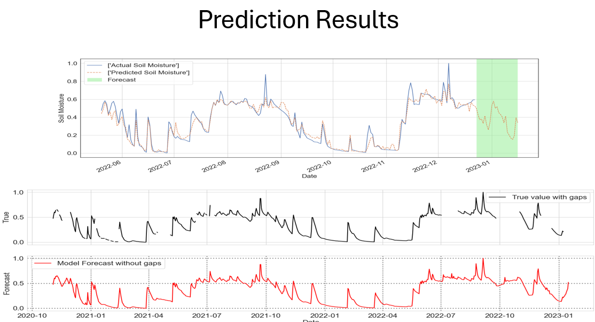
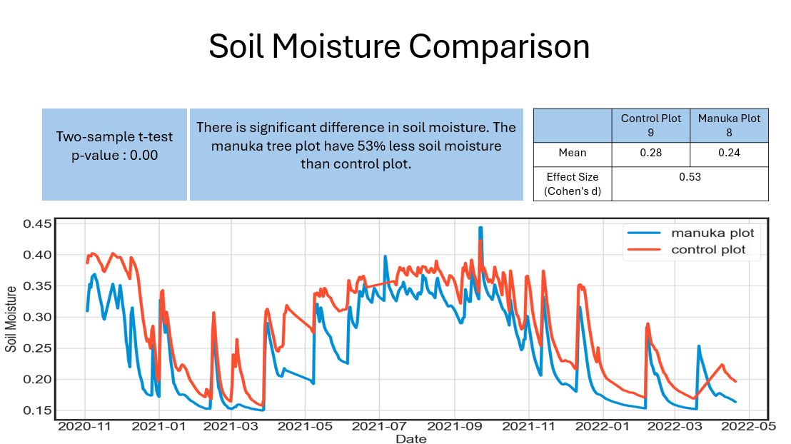
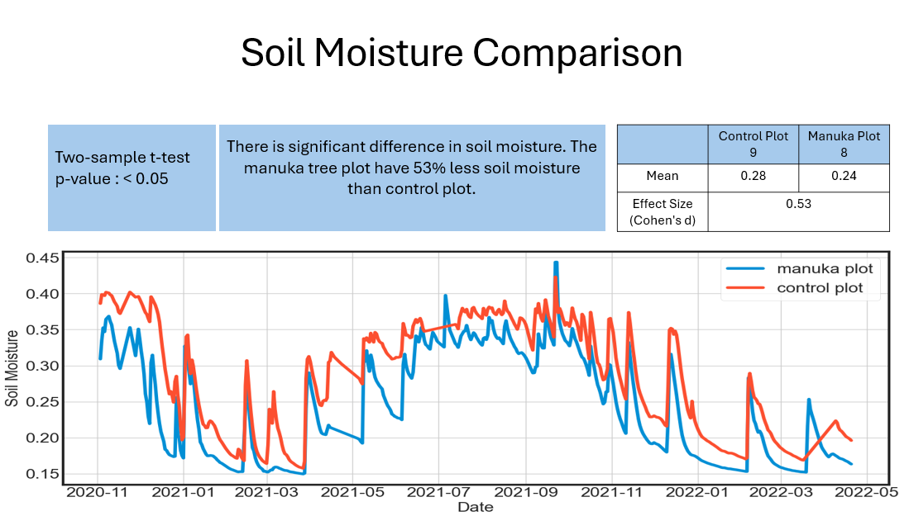
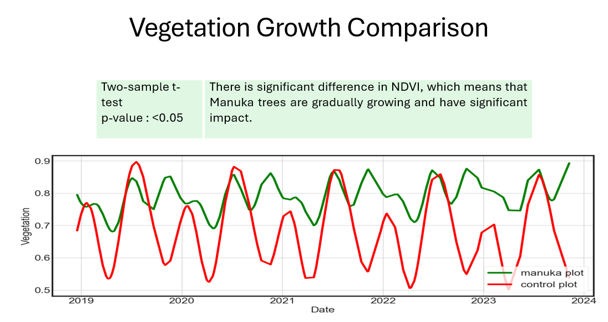
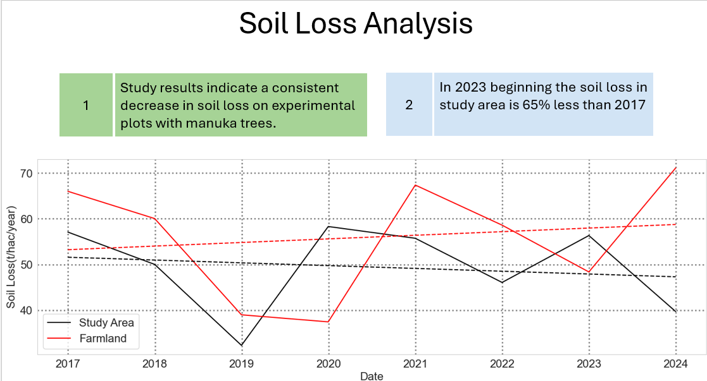
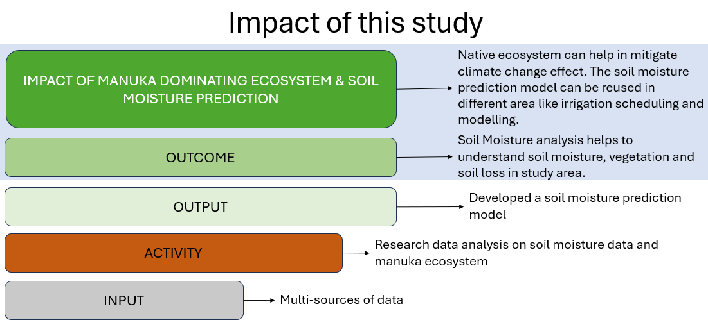

The folder also include 
1) SMAP.js - code for extracting soil moisture data from 'NASA/SMAP/SPL4SMGP/007'. While Using replace x,y with the desired lat and long. 
2) VI.js - code for extracting NDVI and NDMI as time series data from 'COPERNICUS/S2_HARMONIZED'. While Using replace x,y with the desired lat and long.
3) The extended abstract is published, cite: Rassak, S., Orsi, A., Bifet, A., Ginés, M. J. G., Bohm, K., Kevin, I., ... & Bisht, A. (2024, April). The impact of Mânuka-dominated riparian on lake’s water quality–a multi-source remote sensing approach. In 2024 International Conference on Machine Intelligence for GeoAnalytics and Remote Sensing (MIGARS) (pp. 1-3). IEEE.
4) The complete paper will be publishing soon in the Conference Journal
